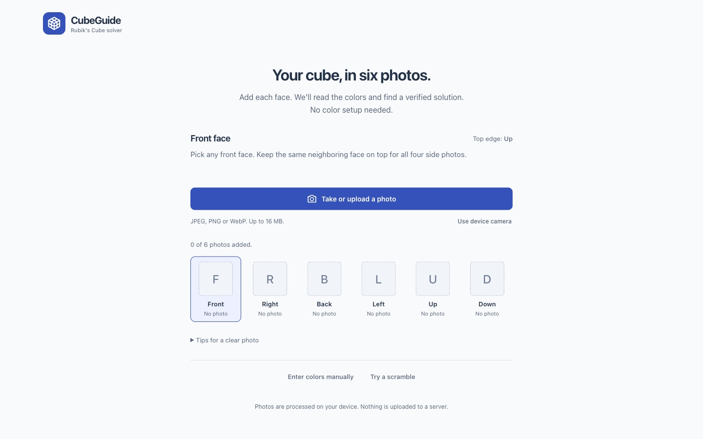
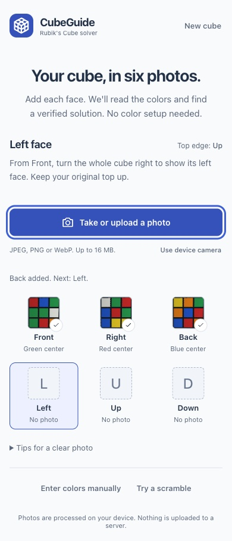
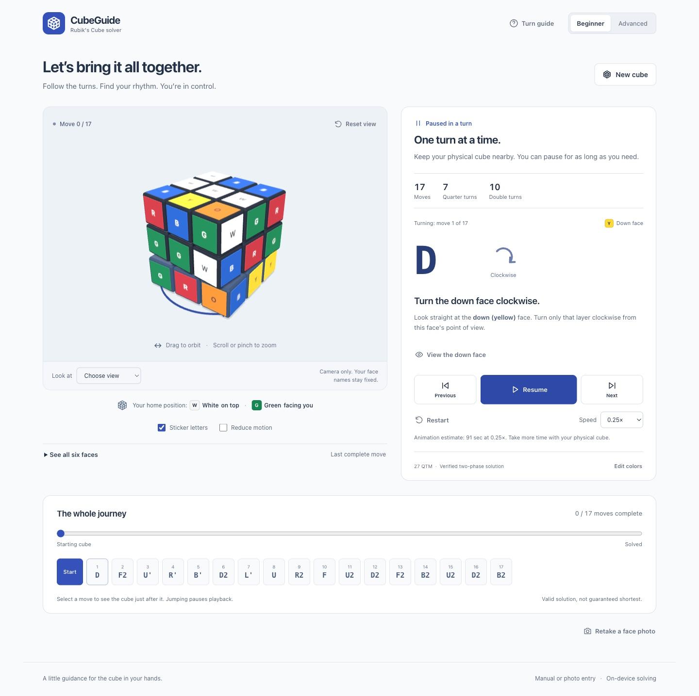

# CubeGuide

A complete, local-first 3x3 Rubik's Cube solver and step-by-step teaching tool.
Take or upload six labeled face photos. The app locates the sticker grids,
reads the center colors, validates the cube, and finds a real solution
automatically. Then follow the moves on an interactive 27-cubelet model.
Manual entry, photo alignment tools, and practice scrambles remain available.



The screenshots in this guide show the actual application using generated
cube states and a synthetic sticker image. They contain no personal photos
and are not evidence of camera-hardware or uncontrolled-lighting accuracy.

**Quick links:** [First use](#solve-your-physical-cube) ·
[Photo input](#take-or-upload-six-face-photos) ·
[Architecture](#architecture-and-why-it-is-built-this-way) ·
[Tests](#tests) · [Dependencies](#dependencies-and-audit-decisions) ·
[Hosting](#static-hosting-and-vercel-readiness)

## Run locally

Use Node.js **20.19+ within 20.x**, **22.12+ within 22.x**, or **24+**, as
specified in `package.json`. A currently supported Node LTS release is
recommended for hosting; Node 20.19.2 remains compatible with this project.
Use npm with lockfile-v3 and `overrides` support. Development and the
dependency cleanup were exercised with Node 20.19.2 and npm 11.4.2.

From the project directory:

```sh
npm ci
npm run dev
```

Open **http://127.0.0.1:5187/**. The server listens only on loopback and uses a
strict port: it fails rather than silently switching to another app's port.
Stop it with Ctrl+C in its terminal.

For a production build:

```sh
npm run build
npm run preview
```

The production preview is **http://127.0.0.1:4187/**. Serve `dist/` over HTTP;
opening `index.html` directly with `file://` does not support the module worker.
No cube-processing backend, app account, or API key is required. Photo processing and solving
stay in your browser. Use manual entry if you do not want to use photos.

### Commands

| Command | Purpose |
| --- | --- |
| `npm ci` | Install the exact committed dependency tree, without rewriting the lockfile. |
| `npm run dev` | Start Vite on strict loopback port 5187. |
| `npm run typecheck` | Check application, configuration, and test TypeScript projects. |
| `npm test` | Run all unit, property-style, solver, photo-analysis, and reducer tests. |
| `npm run test:watch` | Run Vitest in watch mode during development. |
| `npm run test:e2e` | Run real Chromium UI, worker, rendering, and input scenarios. |
| `npm run build` | Typecheck and create production assets in `dist/`. |
| `npm run preview` | Serve the production build locally on strict loopback port 4187. |
| `npm audit` | Check the installed dependency tree against the current advisory feed. |

### If port 5187 is already in use

This is a server-startup conflict, **not evidence that `npm ci` failed**.
An earlier CubeGuide preview may still be running. First open
<http://127.0.0.1:5187/> and check that it really is CubeGuide.

On macOS/Linux, these are read-only checks:

```sh
curl -fsS http://127.0.0.1:5187/ | grep '<title>'
lsof -nP -iTCP:5187 -sTCP:LISTEN
```

If it is the preview you want, reuse it. To restart an instance you own, stop
it with Ctrl+C in its original terminal, then run `npm run dev` again.
Do not kill unrelated Node processes. If another application owns the port,
leave it alone and explicitly choose a different one:

```sh
npm exec -- vite --host 127.0.0.1 --port 5188 --strictPort
```

Tests can target that instance with `CUBE_GUIDE_BASE_URL=http://127.0.0.1:5188`.
The loopback address is local to the machine running the server; a phone on
the same Wi-Fi cannot reach a laptop's `127.0.0.1`. Mobile emulation and a
deployed HTTPS site are different from exposing a local development server.

## Solve your physical cube

1. Hold any face toward you as **Front**, with a neighboring face as your
   original **Up**. This is a holding convention, not a color-selection form.
   Nothing assumes white Up or green Front.
2. Select **Take or upload a photo**, visible without scrolling on desktop
   and phones. Add the Front photo, then Right, Back, Left, Up, and Down.
   The next face and its top-edge guide advance automatically. Turn the
   whole cube between photos, never an individual layer.
3. For a clear photo, the app finds the nine-sticker grid itself. It reads
   the actual center from the pixels; you do not select centers, drag crop
   handles, rotate a grid, or tick review boxes. A bad or ambiguous image
   receives a specific retake message instead of a guessed result.
4. Once all six photos agree, color matching, full physical validation,
   solving, and independent solution verification run automatically.
   The 3D workspace appears for that actual cube, not an example.
5. **Solution ready** means the moves have been verified; the current cube
   is still scrambled. Playback is deliberately **not automatic**. Press
   **Play solution**, or follow one **Next** move at a time. **Cube solved**
   only appears when the current committed cube really is solved and no
   turn is in flight.

The starting screen has no center form, manual grids, mode toggles, metrics,
or WebGL scene. **Enter colors manually** and **Try a scramble** are quiet
secondary routes. Instruction style, the camera, and playback options appear
when relevant. Orbiting the virtual camera never changes the physical
Up/Front reference frame.

**Retake a face photo** keeps the six accepted images after confirming removal
of the old solution. Cancelling the picker, cancelling processing, or submitting
a failed replacement keeps the previous image. A successful replacement is
checked again against the other five photos. **New cube** warns before clearing
meaningful work and returns to the empty photo screen. Switching between
automatic photos and manual/practice input likewise requires confirmation
when it would discard data.

### Face entry reference

These labels name the center beyond an edge of the face you are looking at.
They are not instructions to rotate a layer.

| Face being entered | Top edge | Right edge | Bottom edge | Left edge |
| --- | --- | --- | --- | --- |
| Front (F) | U | R | D | L |
| Right (R) | U | B | D | F |
| Back (B) | U | L | D | R |
| Left (L) | U | F | D | B |
| Up (U) | B | R | F | L |
| Down (D) | F | R | B | L |

For **Back**, turn the whole cube halfway around vertically, keeping Up on top.
Right is now on the left side of the view, and Left on the right.

For **Up**, tilt the whole cube toward you: Back is beyond the top of the grid,
Front beyond the bottom. For **Down**, tilt it away: Front is beyond the top,
Back beyond the bottom. Return to your original Up/Front orientation before
finding the next face.

### Take or upload six face photos

The main action opens the native photo picker, which may include a camera
option on a phone. **Use device camera** supplies the explicit
`capture="environment"` hint. Supported devices may open their camera;
others show a picker. This is not a desktop webcam stream, and no camera
permission is requested merely by loading the page.

Each of the six slots has an explicit face name. Upload one face at a time,
not an unlabeled batch whose order would have to be guessed. Successful
captures show a small perspective-correct thumbnail and the detected center's
name. Selecting a slot makes it the current capture/retake target.

Use even, diffuse light and a little space around the whole face. All nine
stickers and their boundaries must be visible. Avoid flash glare, occlusion,
severe tilt, other visible grids, and busy backgrounds. Keep the displayed
top edge up. Back is not mirrored; Up has Front beyond its bottom edge; Down
has Front beyond its top edge.

There is no required setup, alignment, or review stage on the automatic
happy path. Retakes are still necessary when the image does not support a
confident reading. The app does not invent unseen stickers or force detected
colors to satisfy nine-of-each counts.

Dim photos, moderate fading, thin scratches, and printed center logos can be
read when enough intact pigment and clear boundaries remain. The detector uses
relative contrast rather than a fixed bright-sticker cutoff, and samples
intact areas across each sticker instead of relying on its middle alone.
Keep the camera steady in low light. If a color is erased, covered, clipped by
glare, or too close to another color, add neutral diffuse light or use the
manual route's alignment and editable review. Processing cannot restore
information that is absent from the photo.

JPEG, PNG, and WebP still images are supported, up to **16 MiB**, **24 million
source pixels**, and **8192 pixels on either edge**. Convert HEIC/HEIF first.
SVG, GIF, and animated PNG/WebP are rejected. Headers and bounds are checked
before decoding. Images are reduced to at most 1024 pixels per edge.
EXIF orientation is applied by the browser decoder before grid detection.
The six photographed centers provide the calibration; their physical color
scheme is derived, not selected from an assumed Up/Front preset.

Photos and previews remain local, in memory: no server uploads, browser
storage, external recognition API, or live camera stream. Full working images
are released after processing. Accepted captures retain only their nine RGB
samples and small thumbnails, including while a solution is displayed.
Replacement, confirmed abandonment, reset, and unmount release the appropriate
object URLs. Generation checks prevent late processing from restoring reset
input. Photo work has explicit cancellation and a 20-second timeout; solving
has a separate two-minute limit.



### How automatic photo reading works

This is a small, explainable color-analysis pipeline, not a machine-learning
model or a cloud recognition service.

| Stage | Implementation and reason |
| --- | --- |
| File gate | Check MIME/signature, byte size, dimensions, and supported still-image format before allocating the main decoded pixel buffer. Oversized or corrupt files produce a visible error, not a guessed face. |
| Decode | Use `createImageBitmap` with EXIF orientation support, with a native image fallback. Downsample while preserving aspect ratio; keep at most a 1024-by-1024 working raster. |
| Locate | Area-downsample the whole image to a bounded 480-pixel working scale. Three bounded median-filter scales remove noise and thin scratches while exposure-relative contrast boundaries separate dark, gray, or light cube bodies. Retain plausible rounded sticker contours, including hollow contours around center printing. This is real localization, not a default central crop. |
| Fit | Search contour centroids for nine centers in a projective 3x3 grid. Check positional error and each contour's area relative to its projected cell, so a scratch fragment cannot pull the crop toward itself. Compare detections across filter scales; reject multiple, missing, clipped, tiny, or strongly distorted grids. |
| Sample | Collect a 15-by-15 grid across the inner 70% of each sticker. Find a coherent pigment/neutral cluster, require support across the cell (including all four corner regions), and take trimmed RGB means. Sparse scratches, dark logos, and small reflections are outliers; competing colors, insufficient coverage, deep darkness, or extensive glare remain unreadable. |
| Identify centers | Match the six middle stickers to plausible named standard colors. Reject uncertain, repeated, or insufficiently separated centers. Do not force a one-to-one assignment simply because six photos were supplied. |
| Calibrate | Reclassify all 54 samples against the six actual centers using hue, which tolerates exposure changes and neutral fading better than saturation-sensitive RGB/Lab matching. Preserve a minimum color signal, a white-versus-faded uncertainty band, hue-distance/margin checks, and an exposure-normalized D65 CIELAB center-separation check. This cannot correct arbitrary colored lighting or glare. |
| Orient | Use the named face and displayed top-edge convention. If piece identities disagree, try the bounded set of in-plane quarter turns and accept recovery only when it yields one distinct physically valid cube. Multiple interpretations require a retake. |
| Validate | Use the existing physical validator for colors, centers, pieces, orientations, and parity. Count, edge-flip, corner-twist, and parity failures are not silently “repaired” into a different cube. |
| Solve | Supply the complete photo capture through the normal input boundary, then run the established solver and independent replay. Only a verified result becomes a solution; playback stays deliberate. |

Grid location, color analysis, and orientation recovery run in the photo
worker, separate from the solver worker. The main-thread client checks
response shapes and independently validates a claimed reconstruction.
Browser-native image decoding and small canvas previews remain bounded
asynchronous operations.

A single image cannot reveal the hidden faces of an opaque cube. Even three
visible faces usually obscure parts of other stickers and do not supply all
54 colors. Six deliberately oriented face images avoid inventing unseen
state. The same Back/Up/Down convention applies to photos and manual grids.
A correctly oriented, already valid literal reading is not replaced by a
different valid interpretation. Rotation recovery is a fallback, not a claim
that arbitrary unlabeled or mirrored photos can be reconstructed uniquely.

Confidence scores are internal heuristics, not accuracy probabilities. A
physically valid cube is necessary but does not prove that every pixel was
recognized correctly: a consistent wrong or mislabeled reading can describe
another valid cube. Compare the displayed cube with your physical one before
following moves. This caution does not add a mandatory review checkbox.

### Manual entry and optional alignment tools

Choose **Enter colors manually**, select six distinct center colors, and
**Lock centers & enter stickers**. Paint the remaining 48 stickers with
named colors. Centers stay fixed. `?` and a striped background mean empty,
not white. The six interactive grids include explicit top/right references,
and **Check colors & solve** reports actionable physical errors.

After locking centers, **Align/review a face photo** opens the original
assisted editor as an optional fallback. It is not part of the default
automatic path. Rotate the photo upright and place the four numbered handles
around the face, clockwise from top-left. Arrow keys move a focused handle
by one image pixel; Shift uses ten. **Detect nine colors** creates editable
named estimates. Check all nine colors and separately acknowledge a
center mismatch before **Use reviewed face** commits that face.

This optional editor preserves fixed centers and all other faces. Replacing
entered colors or abandoning a review uses explicit confirmation. Repeated
requests focus the same draft instead of resetting it. **Edit colors** from a
solution restores the original 54 colors in the manual editor, not a partly
played state.

## Architecture and why it is built this way


### Stack choices

| Choice | Why it fits this application | Tradeoff |
| --- | --- | --- |
| React + TypeScript | Native controls, predictable component lifetimes, and typed contracts connect entry, worker messages, and playback. The UI can stay declarative without owning a second cube engine. | React alone does not make races safe; cancellation, generations, and input validation remain explicit. |
| Vite | Provides a small static-app build, TypeScript development workflow, and native module-worker bundling. No server framework is needed for solving. | Development and production asset paths still need separate browser verification. |
| Direct Three.js | Gives direct control over a fixed 27-cubelet scene, camera, layer highlighting, and exact transforms. The renderer is an adapter over the reducer state. | Camera/resource lifecycles are implemented explicitly instead of delegated to a React scene wrapper. |
| Independent cube engine + `cubejs` | The app owns the state representation and can check an established solver's answer independently. This avoids inventing an unproven search algorithm or solving only by reversing known scrambles. | There are two implementations to reconcile at a narrow facelet boundary; conversion and oracle tests are important. |
| Dedicated Web Workers | Photo localization/analysis and solver initialization/search do not block the main-thread controls. The solver receives a state, not the practice scramble history. | Starting workers has a cost; cancellation, bounded work, and stale-response guards remain explicit. |
| Immutable snapshots + reducer | Forward, inverse, seek, restart, pause, and interruptions share one explicit transition model. Every committed step has an exact destination. | Keeping all solution snapshots uses some extra memory, but the cube and move sequence are small. |
| Local geometric/color analysis | Automatically locates actual sticker grids and derives calibration from centers without accounts, cloud-vision costs, or model downloads. | Requires six labeled, sufficiently clear faces. Uncertain/ambiguous input needs retakes; optional alignment/manual correction remains available. |

React Three Fiber, a global state-management package, and an animation library
were not necessary for this fixed scene and reducer. That is a scope choice,
not a claim that those tools are unsuitable generally.

### One authoritative cube, several derived views

`CubeState` holds four immutable arrays:

| Field | Meaning |
| --- | --- |
| `cp` | Permutation of the eight corners. |
| `co` | Orientation of each corner. |
| `ep` | Permutation of the twelve edges. |
| `eo` | Orientation of each edge. |

The six detected or manually chosen center colors define the input reference frame separately.
Facelets use **U, R, F, D, L, B** order, nine cells per face. Conversions map
those facelets to pieces and back. The 54-color entry array is an **input
draft**, not a second live cube: it can be incomplete or invalid until the
validator accepts it. No example cube appears in the automatic landing flow.
The secondary manual route retains its explicitly labeled 3D orientation
reference until the user submits a valid entry.

Moves are structured as `{ face, turns }`, with `turns` equal to `1`, `-1`,
or `2`. Strings such as `R'` are parsed/formatted at boundaries. The app's
move transformations come from integer facelet geometry, so the engine,
facelet conversion, face-highlighting axis, and renderer use the same
coordinate conventions. Tests also compare moves with an independent engine
to catch correlated mistakes.

### Solver boundary and verification

`solve.ts` imports `cubejs` only in the worker or Node tests. The worker
initializes the established two-phase tables, computes a sequence, and
replays it. The client treats even that result as untrusted structured data:
it validates the response and independently applies the moves to the
**original request's cube**, not a potentially changed UI state.

The resulting `VerifiedSolution` freezes moves and every step snapshot,
including step zero. A stale request ID cannot replace a newer cube.
Cancellation terminates pending work; an idle worker can be reused for a
subsequent solve. Initialization, search, verification, failure, and a
two-minute timeout are distinct states. There is no success-shaped fallback
when solving or verification fails.

`optimizeDeps.include: ['cubejs']` is deliberate. It prevents Vite's first
worker use from discovering that dependency late and reloading the
development page in the middle of a user's entry.

### Animation and physical direction

The playback reducer owns the committed cube, current step, transition,
progress, target snapshot, speed, running state, and frame generation.
The scene does not apply logical moves. It renders the committed state plus
the current transition, rotating only the nine cubelets in the affected
layer. Every frame starts from canonical lattice positions, rather than
accumulating the previous frame's floating-point rotations.

**Pause** freezes the active transition itself. **Previous** can reverse the
unfinished portion of a turn; **Next** can complete or reverse an unfinished
undo. **Seek** and **Restart** invalidate old frame generations and select
exact snapshots. Changing speed scales future progress without jumping to
another position. Hidden-tab playback is paused rather than allowed to
silently finish moves.

The physical direction cue is separate from algebraic notation. A half-turn
is its own algebraic inverse, but backing out of a partially animated `R2`
must reverse the actual arrow and motion. Clockwise/counter-clockwise always
means looking straight at the named face, not looking at the scene from an
arbitrary orbit-camera angle.

Camera presets recreate OrbitControls to remove cached orientation and
damping state. Camera orbit, zoom, and reset never change the logical cube
or the user's chosen Front/Up colors.



## Playback and practice

- **Play / Pause / Resume:** pause freezes even a partially turned layer.
  Nothing completes in the background while paused. Switching to a hidden tab
  pauses playback; resuming is explicit.
- **Next:** complete exactly one move. During an unfinished undo, it returns
  to that undo's starting position.
- **Previous:** animate the inverse of the last completed move. During an
  unfinished forward turn, reverse only the unfinished portion without a snap.
  A reversed partial half-turn has a counter-clockwise indicator even though
  its algebraic notation remains `R2`, `L2`, etc.
- **Restart / timeline / scrubber:** cancel any active transition and use an
  exact immutable snapshot. Selecting move 7 means the state *after* move 7.
- **Speed:** 0.25x, 0.5x, 1x, 1.5x, or 2x; changes apply to the current turn
  without changing its progress.
- **Camera:** mouse or touch orbit, wheel or pinch zoom, exact face presets,
  and Reset view. A flat six-face view is also available.
- **Beginner / Advanced:** detailed physical instructions or a compact
  notation-oriented presentation. On small screens the move cue and playback
  controls stay docked beside the visible cube viewport.
- **Practice:** Try a scramble generates a fresh 25-move legal random sequence.
  The solver receives only the resulting state, never the scramble history.
  Advanced practice adds all 18 direct face-turn buttons.
- **Reset / Edit:** destructive changes require confirmation. Editing a
  solution restores its original entered colors, not a partially played state.

An animation time estimate includes turn durations and the short pause between
moves at the selected speed. It is **not** a prediction of human solve time.
The move count counts each half-turn once. QTM counts it as two quarter turns.
The two-phase solver produces valid solutions, **not guaranteed shortest ones**;
even a simple position can receive a longer solution.

At 1x, a quarter-turn is 900 ms, a half-turn 1250 ms, and automatic playback
includes a 240 ms pause between moves. The estimate is derived from those
durations at the selected speed. The separate “Quarter turns” and “Double
turns” counts describe move types; QTM counts every double turn twice.
Practice scrambles are fresh legal 25-move sequences, not a claim of uniform
random-state sampling or an official competition scrambler.

### Keyboard

When the page itself is focused:

| Key | Action |
| --- | --- |
| Space | Play, pause, or resume a solution |
| Left / Right arrow | Previous / next |
| Home | Restart |
| U, R, F, D, L, B | Direct face turn in Advanced practice |
| Shift + face key | Inverse direct turn |
| Hold 2 + face key | Double direct turn |

These shortcuts do not intercept typing or focused buttons, links, selects,
sliders, editable content, or dialogs. All controls are also natively
keyboard-accessible. A paused manual turn always exposes **Resume turn**,
including after cancelling a New cube dialog or hiding the tab.

**Reduce motion** follows the system preference initially and can be changed.
It replaces rotating transitions with timed, exact state changes; the same
pause, stepping, seeking, and speed controls continue to work.

## Validation and correctness

The validator checks:

- exactly 54 recognized stickers and nine of every named color;
- six distinct fixed centers defining the entered scheme;
- all 12 edges and eight corners, each appearing exactly once;
- ordered corner chirality (mirrored corners are invalid);
- even total edge flips, balanced corner twists, and matching permutation parity.

Piece errors name their colors and affected locations when known. Global
orientation/parity errors explicitly avoid inventing a single offending piece.
Custom distinct center schemes are allowed; conventional opposite-color pairs
are not hardcoded. As with a physical cube, all input must use one consistent
reference frame.

The application's own engine is independent of the solver library. It keeps
immutable corner/edge permutations and orientations as the authoritative
state. Facelets and rendered stickers are derived from that state. Singmaster
transformations are generated from exact integer sticker geometry.

`cubejs` implements Kociemba's two-phase search. Its table initialization,
search, and first verification run in a Web Worker. The main thread validates
the response and independently replays it against the original request again,
producing a deeply frozen snapshot for every step. Changing input cancels and
terminates in-flight work; request generations ignore late responses. Worker
loading failures and a two-minute timeout surface retryable errors.

The renderer never commits logical state. It displays the committed cube plus
a transition progress value. Every frame begins with exact lattice positions,
not previously rotated coordinates. At completion the reducer commits the
next snapshot and the meshes return to exact axis-aligned transforms.

### Why these validity checks matter

Nine stickers of every color is necessary but not sufficient. A cube with
one flipped edge, one twisted corner, a mirrored corner, or an unmatched
permutation parity can have perfectly correct color totals and still be
unreachable using legal face turns.

The validator checks that all twelve edge identities and all eight corner
identities appear once, that edge orientations sum to an even number, that
corner orientations sum to a multiple of three, and that corner/edge
permutation parity agrees. It reports identifiable piece colors and
locations, but it does not invent one “bad piece” for a global parity error.
See [`validation.ts`](src/cube/validation.ts) and its impossible-input tests.

## Performance, accessibility, and privacy tradeoffs

The interface stays task-focused rather than adding a marketing page.
The default is one upload action, six compact face slots, short orientation
guidance, and whitespace. Manual entry and practice are secondary. Center
forms, manual grids, mode toggles, and example-cube controls are not shown
before automatic capture. On narrow screens the solution's cube and task stack
vertically; playback controls/current-move guidance dock near the viewport
bottom. The photo action itself is visible without scrolling at the tested
desktop and phone widths.

Native buttons, selects, checkboxes, sliders, and dialogs provide familiar
keyboard behavior. Programmatic focus advances to the next upload action,
identifies retake errors, and moves to the verified solution or a confirmed
new-input route. Existing photo data survives cancelled/failed replacements.
Optional alignment handles support pointer/touch and arrow keys, use 44px
targets on phones, and do not prevent scrolling elsewhere in the image.

Names and W/Y/G/B/R/O symbols supplement colors. Empty cells have both `?`
and a striped pattern. Focus outlines, piece-specific validation messages,
center mismatch alerts, loading/cancellation states, and reduced motion are
part of the normal workflow, not separate demonstration screens.

The fixed 27-cubelet scene keeps rendering complexity bounded, but Three.js
and WebGL are still a meaningful download/graphics cost. The viewport is
lazy-loaded only when needed; it is neither mounted nor drawn on the default
photo screen. Three.js has its own build chunk, and photo/solver work has
separate worker assets. Image analysis uses a bounded raster rather than a large
recognition model. There is no promised solve latency, frame rate, or camera
accuracy for arbitrary hardware. The written guide and flat cube view remain
useful when a graphics failure is explicitly reported.

No backend receives the cube or photos, and no cloud-vision SDK is included.
Production Vercel deployments use `@vercel/analytics` for aggregated page views
and visitor statistics. Local development, ordinary local production previews,
and Vercel preview deployments do not load the analytics collector. The app
does not send photo files, filenames, sticker colors, cube states, solutions,
or custom interaction events to analytics. Its `beforeSend` filter removes
query strings and fragments from the tracked page URL and rejects custom events.
Vercel's standard traffic metadata, such as referrer, browser/device, and
approximate location, is separate from cube data; see its
[privacy documentation](https://vercel.com/docs/analytics/privacy-policy).
The live footer discloses this distinction.

Local object URLs and decoded images are released on
replacement, confirmed abandonment, reset, or unmount; pending operations
are versioned/aborted. “Local processing” does not mean a service worker or
offline installation is implemented: the browser must first load the static
application assets, and refreshing loses the in-memory session.

## Tests

```sh
npm run typecheck
npm test

# First-time browser setup:
npx playwright install chromium
npm run test:e2e
```

Vitest covers all 18 moves against an independent engine, four-turn and inverse
identities, conversions, 200 seeded scramble round-trips, color/center entry,
impossible states, worker cancellation/failure, immutable verification, physical
direction cues, and deterministic playback interruptions. Photo tests cover
full-frame location across translated/scaled/rolled/perspective rasters,
light/gray/dark bodies, incomplete/multiple/cluttered grids, center-only
calibration, unique versus ambiguous orientation recovery, worker response
guards, review/fixed-center fallback, unsupported/oversized/animated inputs,
and six-photo reconstruction with standard and alternate center schemes.
Worn-photo regressions additionally exercise reduced exposure with sensor
noise, uneven shadows, rounded/narrow-gap stickers, independently faded
stickers, crossing scratches, center printing, and combinations of those
conditions. They assert the actual nine/54 colors and inferred face corners,
not merely that processing completes. Missing pigment, competing colors,
occlusion, extreme darkness, and heavy glare must still be rejected.

Each full unit run performs **160 real solver cases**: 120 deterministic
25-40-move scrambles entered through color mapping, 24 fresh cryptographically
random scrambles, and 16 random cubie states from the independent library with
no scramble history. These are solver tests, not inverse-scramble stand-ins.

The Playwright suite uses the actual browser UI and worker. It covers complete
manual input, random solving, every playback control, all 18 signed layer
animations, partial half-turn reversals, camera views, failures/cancellation,
reset confirmation, keyboard handling, mobile touch, and reduced motion.
The automatic suite starts fresh on desktop and touch-enabled mobile.
It uploads six actual PNG/JPEG/WebP rasters, including an EXIF-oriented JPEG,
off-center/perspective faces, and a quarter-turned face, without selecting
centers, cropping, reviewing, or pressing an extra solve button. It verifies
the derived 54 colors and original cube, replays every returned snapshot,
and exercises actual layer motion through pause/resume to matching solved
meshes. The first upload action is also checked at 320 pixels.
Separate desktop/mobile cases encode degraded captures as real JPEG/WebP
files, including compression, dim exposure, fading, scratches, shadows, and
logos. They require the exact original cube and all solution snapshots, then
animate to matching solved logical and mesh facelets.

Other cases cover ambiguous/duplicate/uncertain input, failed replacements,
picker/processing cancellation, worker loading failure and retry, reset races,
manual fallback, and preview cleanup. The separate assisted-photo regression
still moves crop handles, corrects estimates, checks fixed-center/overwrite
guards, solves its real entered cube, and verifies rendered motion.
These are generated pixel fixtures, not a field accuracy benchmark.
No failing user photograph was supplied for the worn-sticker refinement;
its exact camera/lighting case has not been reproduced. Physical devices,
uncontrolled colored lighting, and completely erased colors are not certified
by these tests.
Assertions inspect actual sticker meshes and their transforms, not just
success text. The visibility interruption test explicitly simulates the
Page Visibility event; mobile gestures run in touch-enabled Chromium.

The suite starts its own server unless a server already responds on 5187.
Tests verify CubeGuide's actual controls and diagnostic identity, not merely
the presence of a server. Automatic entry specifically has no initial scene.
Failure traces are in `test-results/`.
The complete playback case also attaches JSON synchronization evidence.

To smoke-test the built worker and assets, run `npm run preview` in another
terminal after building, then:

```sh
CUBE_GUIDE_BASE_URL=http://127.0.0.1:4187 npm run test:e2e -- --grep 'six photos alone|dim, faded|random scramble ->|six real raster uploads'
```

For a focused landing-path check:

```sh
npm run test:e2e -- tests/e2e/automatic-photo.spec.ts
```

Test organization:

| Suite | What it verifies |
| --- | --- |
| `engine.test.ts` | All move variants, identities/inverses, conversions, and seeded scramble round-trips. |
| `validation.test.ts` | Real color entry, center mapping, counts, duplicated/mirrored pieces, flips, twists, and parity. |
| `solver.test.ts` | Real established search over 160 valid cases, followed by replay verification. |
| `worker-client.test.ts` | Malformed/incorrect responses, cancellation, stale results, and timeout behavior. |
| `playback.test.ts`, `cue.test.ts` | Reducer transitions, interruptions, snapshots, speeds, and physically correct arrows. |
| `photo.test.ts` | Sampling, perspective, orientation, lighting variations, file guards, review, and provider isolation. |
| `automatic-photo.test.ts` | Actual grid localization, detected center schemes, calibrated reconstruction, orientation ambiguity, and impossible captures. |
| `photo-robustness.test.ts` | Dim/faded/scratched/printed-sticker recognition, exact degraded-photo reconstruction, and conservative rejection of missing/conflicting pixel evidence. |
| `photo-worker.test.ts` | Pixel-buffer transfer, malformed responses, stale requests, independent validation, cancellation, and timeout. |
| `analytics.test.ts` | Production-only collection, tracked URL redaction, and rejection of custom events. |
| `analytics.spec.ts` | No local collector, actual production SDK injection/privacy callback, and photo entry when analytics is blocked. |
| `app.spec.ts` | Actual browser workers, all controls, signed 3D turns, manual entry, camera, mobile, and reduced motion. |
| `automatic-photo.spec.ts` | Upload-only desktop/mobile solving, real EXIF/perspective and degraded JPEG/WebP images, unsafe-input refusal, retention/focus, and solved mesh/model equality. |
| `photo.spec.ts` | Secondary alignment/review, actual raster uploads, privacy/resource guards, and solved mesh/model equality. |

Browser installation is a one-time environment step, not an app dependency
download at runtime. In a minimal Linux environment, Playwright may also
need its documented system libraries. The test configuration uses Chromium
with software WebGL support; touch/device emulation does not certify a
physical Android or iOS camera. There is no invented coverage percentage,
CI status badge, or automatic deployment attached to these local commands.

## Source map

| Area | Principal files |
| --- | --- |
| Typed cube engine | `src/cube/types.ts`, `model.ts`, `geometry.ts`, `moves.ts`, `notation.ts`, `scramble.ts` |
| Physical validation | `src/cube/validation.ts` |
| Solver boundary | `src/cube/solver/solve.ts`, `solver.worker.ts`, `client.ts`, `protocol.ts`, `verification.ts` |
| Playback and direction | `src/cube/animation/playback.ts`, `cue.ts`, `src/hooks/usePlayback.ts` |
| 3D model and camera | `src/cube/rendering/CubeScene.ts`, `src/components/CubeViewport.tsx` |
| Input providers and manual entry | `src/input/provider.ts`, `orientation.ts`, `src/components/FaceInput.tsx` |
| Automatic photo entry | `src/components/AutomaticPhotoInput.tsx`, `src/input/photo/{locate,automatic,client,protocol,photo.worker}.ts`, `src/styles/automatic.css` |
| Shared photo decoding/color math | `src/input/photo/{decode,load,geometry,analysis}.ts` |
| Optional alignment/review | `src/components/PhotoInput.tsx`, `src/styles/photo.css` |
| Teaching interface | `src/App.tsx`, `SolutionPanel.tsx`, `PracticePanel.tsx`, `CubeNet.tsx`, `Dialogs.tsx` |
| Tests and generated image fixtures | `tests/unit/`, `tests/e2e/`, `tests/fixtures/` |
| Product/design context | `PRODUCT.md`, `DESIGN.md`, `.impeccable/` |

Runtime dependencies: React 19.2, React DOM 19.2, Three.js 0.180, cubejs
1.3.2, and Vercel Web Analytics 2.0.1. Development tooling: TypeScript 5.9, Vite 6.4, Vitest 4.1, and
Playwright 1.56. Exact resolutions are recorded in `package-lock.json`.

For local debugging, the read-only `window.__cubeGuide.inspect()` returns
logical facelets, verified snapshots, playback state, and geometric scene
diagnostics (`visual: null` before a viewport is needed). Rendered facelets are reconstructed from actual mesh positions,
orientations, and sticker colors. This API has no mutation or solver shortcuts.

## Dependencies and audit decisions

The dependency cleanup reproduced **45 advisory entries** in the original
installed tree. Many came from `cubejs` declaring an obsolete npm 6 CLI as
a production dependency, not from a runtime import in the solver itself.
Its entry point loads only its cube and search modules. npm's production
dependency classification is therefore not the same as what Vite ships in
the browser.

| Dependency | Resolution | Reason and scope |
| --- | --- | --- |
| `cubejs` | Kept at **1.3.2** | Preserve the established solver and tested API; do not downgrade the algorithm simply because an audit suggests removing its dependency chain. |
| `cubejs` → `npm` | Scoped override to **11.20.0** | Replace the unused obsolete CLI tree with a release compatible with Node 20.19. This does not update the user's global npm or import the CLI into the app. npm 12 was not selected because its Node requirement is newer. |
| `vite` | **6.4.3** | Same-major development/build-tool patch for the reported advisories. The deployed site consists of static assets, not a running Vite development server. |
| `vitest` | **4.1.11** | Test-only major update needed for the remaining mocker advisory; 3.2.7 still reported it. The documented Node >=20 / Vite >=6 requirements match this project, and the existing test configuration and tests pass without API workarounds. |

The relevant remaining Vitest issue before that update was
[GHSA-82fw-gwwq-j7x9](https://github.com/advisories/GHSA-82fw-gwwq-j7x9).
The [Vitest migration guide](https://vitest.dev/guide/migration) explains its
compatibility and breaking changes. This project does not use the removed
workspace, coverage, custom-pool, or browser-provider configuration.

After the manifest changes, the lockfile was resolved and the clean install
was reproduced:

```sh
npm ci
npm audit
npm audit --omit=dev
npm ls cubejs npm vite vitest --depth=2
```

Both full and production-scope audits returned **0 vulnerabilities** against
the advisory feed used for this revision. No `npm audit fix --force`,
advisory suppression, solver shortcut, or global package-manager change was
used. Advisory data changes over time; repeat these commands before future
publication rather than treating this result as a perpetual guarantee.

## Static hosting and Vercel readiness

The application builds to ordinary static files. It needs no server functions,
database, environment secrets, camera backend, or account system. Both workers
are generated assets loaded from the same origin. Use a real HTTP(S) server;
`file://` is not a supported deployment.

For an authorized Vercel project after the source has been pushed to
`ass-ier/CubeGuide`, the relevant build settings are:

| Setting | Value |
| --- | --- |
| Framework | Vite |
| Root directory | Repository root |
| Install command | `npm ci` |
| Build command | `npm run build` |
| Output directory | `dist` |
| Build Node version | A supported LTS satisfying the package engines, such as Node 24 |
| App environment variables | No secrets required; keep Vercel's automatic system environment variables exposed for analytics |

There is no client-side path router or server API to rewrite. Hosting must
serve the emitted JavaScript, CSS, and worker assets correctly. A static host
serves the application files; photo processing still occurs in the user's
browser. Native capture behavior remains device/browser dependent even on
HTTPS.

This repository does **not** claim an already published Vercel site, contain
an anonymous deployment URL, or imply authorization for another account.
Owner authentication and the required GitHub source push are separate from
build readiness. `.vercel/`, `.env*`, generated output, dependencies, test
traces, and local tool caches are excluded from Git. No application license,
CI pipeline, paid service, custom domain, or hosting resource is invented by
these instructions.

### Enable Vercel Web Analytics

The official `@vercel/analytics/react` component is mounted once in
`src/main.tsx`. Collection is enabled only when Vite builds for production
and `VITE_VERCEL_ENV=production`. Vercel supplies this variable automatically
for its Vite framework preset when system environment variables are exposed;
there is no analytics API key to put in the client.

1. Open **Analytics** in the existing CubeGuide Vercel project and enable
   Web Analytics if it is not already enabled. A **Get Started** screen asking
   for the React package still needs the updated app to be deployed.
2. Deploy the source containing the updated `package.json`, lockfile, and
   application code to that same project. Enabling the dashboard alone does
   not add the React integration to an older deployed build.
3. Visit the production site, then check its Analytics dashboard after a short
   delay (Vercel suggests checking after about 30 seconds). Browser content
   blockers can prevent a visit from being recorded; they must not prevent
   photo entry or solving.

Local tests intentionally send no real visitor traffic. To exercise the
production integration with a stubbed collector:

```sh
VITE_VERCEL_ENV=production npm run build
npm run preview
# In a second terminal:
CUBE_GUIDE_BASE_URL=http://127.0.0.1:4187 CUBE_GUIDE_ANALYTICS_ENABLED=1 npm run test:e2e -- tests/e2e/analytics.spec.ts
```

These checks verify SDK loading and privacy filtering, not Vercel dashboard
ingestion. Rebuild normally (`npm run build`, without the environment override)
before running other local production scenarios; the normal local preview
does not have Vercel's `/_vercel/insights/*` endpoints and does not load them.
See the official [analytics quickstart](https://vercel.com/docs/analytics/quickstart)
and [Vite environment guidance](https://vercel.com/docs/frameworks/frontend/vite#environment-variables).

## Deliberate limitations

- **Automatic does not mean every photo is readable.** The default path needs
  six labeled, sufficiently clear faces, visible sticker boundaries, and the
  displayed top-edge convention. It rejects uncertain/ambiguous readings
  rather than choosing a convenient valid cube. Native capture is a
  browser/device hint; physical camera hardware and arbitrary lighting have
  not been certified. There is no live-video scanner or hidden-sticker
  reconstruction. Manual alignment/review is an optional fallback.
- **No persistence.** Refreshing closes the current session state. Reset/new
  cube actions within the app warn before discarding meaningful work.
- Standard six-color 3x3 cubes only; no picture-cube center orientation,
  higher-order cubes, whole-cube rotation notation, or wide/slice turns.
- Direct layer manipulation uses buttons and keys, not drag-to-turn gestures.
  Dragging the 3D view moves the camera.
- WebGL and a modern browser are required for 3D. A graphics failure is
  explicitly reported; the written instructions and flat face view remain
  usable. Chromium desktop/mobile emulation is automated; real iOS Safari and
  Android devices have not been independently certified.
- Beginner mode explains individual turns; it is not a complete named-method
  course, a shortest-solution guarantee, or a physical robot controller.

## Realistic extensions

The input-provider boundary can accept other capture sources without changing
the validator, solver, or renderer. The implemented detector can be extended
with better white-balance handling and a representative real-device/photo
corpus; stronger accuracy claims or live capture require that evidence.
Persistence/PWA support would need explicit restore, validation, privacy, and
stale-solution rules. Drag-to-turn interaction would need to join the existing
playback state machine rather than moving meshes independently.

Those are possible follow-on projects, not implemented capabilities of the
current app.
